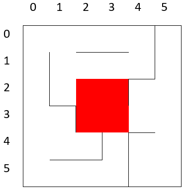

# A* maze solver
A star algorithm implementation for maze solution problem.

Task (in Polish):

## Opis
Dany jest labirynt o rozmiarze n na m pól gdzie 2 <= n 1024 i  2 <= m < 1024. Wyjściem z labiryntu są 4 środkowe pola. Jeśli liczba pól w wierszu/kolumnie jest nieparzysta, to wyjściem jest środkowe pole oraz pole po lewej/powyżej środkowego pola.
W labiryncie znajduje się robot umieszczony w dowolnym polu labiryntu ustawiony w podanej orientacji (N S W E).
Zadaniem jest opracowanie i zaimplementowanie algorytmu sterowania robotem w taki sposób,
żeby robot doszedł do wyjścia z labiryntu znajdując jak najkrótszą ścieżkę:

* przy jak najmniejszej licznie odwiedzonych pól,
* przy jak najmniejszym koszcie - liczbie ruchów.

Jako ruch robota liczy się:
* Przesunięcie robota o jedno pole do przodu – koszt 1,
* Przesunięcie robota o jedno pole do tyłu – koszt 1,
* Przesunięcie – teleportacja -  robota z pola A do pola B na planszy, gdzie pole B musiało być wcześniej widziane przez robota – koszt jest równy sumie odległości między polami w wierszach i kolumnach (teleportacja z pola (2,4) do pola (8,1) - koszt |2-8|+|4-1|=9).
 
Pole, które widział robot, to pola które: robot odwiedził oraz wszystkie pola które przylegają do pól, które robot odwiedził i nie są od nich oddzielone ścianką.

Należy zaimplementować klasę implementującą algorytm zachowania robota.

## Aplikacja

Należy również wykonać aplikację, która będzie pokazywała stan labiryntu po każdym rucho robota pokazując:
* wygląd labiryntu (ściany),
* pola odwiedzone przez robota,
* aktualne położenie robota,.

Po znalezieniu najkrótszej ścieżki należy wyświetlić:
* znalezioną ścieżkę (lista pól) oraz jek koszt (długość)
* liczbę odwiedzonych przez robota pól,
* liczbę ruchów wykonanych przez robota (uwzględniających teleportację).

Aplikacja może być uruchomiona z jednym lub dwoma parametrami.
Pierwszy parametr „-d” jest opcjonalny i jeśli zostanie użyty aplikacja wyświetla stan planszy po każdym ruchu robota.
Drugi parametr jest obowiązkowy i jest to nazwa pliku z definicją labiryntu.

## Format pliku z definicją labiryntu
Labirynt jest definiowany w pliku tekstowym w którym w kolejnych liniach są zapisane:
* rozmiar labiryntu, dwie liczby określające liczbę kolumn i liczbę wierszy,
* początkowe położenie i kierunek robota, dwie liczby (numer kolumny i numer wiersza – od 0)
 określające położenie i litera (N S W E) określająca kierunek ustawienia robota,
* informacje o kolejnych ścianach pionowych w labiryncie w kolejności od lewej do prawej i od góry do dołu,
0 oznacza brak ściany a 1 obecność ściany,
* informacje o kolejnych ścianach poziomych w labiryncie w kolejności od lewej do prawej i od góry do dołu,
0 oznacza brak ściany a 1 obecność ściany,

### Przykład:
    6 6
    0 0 S
    0 0 0 0 1
    1 0 0 0 1
    1 0 0 1 0
    0 1 0 0 0
    0 0 1 1 0
    0 0 0 1 0
    0 0 1 1 0 0
    0 0 0 0 1 0
    0 1 0 0 0 0
    0 0 0 0 1 0
    0 1 1 0 0 0

 

Task Source:
# AISDI zadanie grafowe -  eksploracja labiryntu
Waldemar Grabski <waldemar.grabski@pw.edu.pl>
